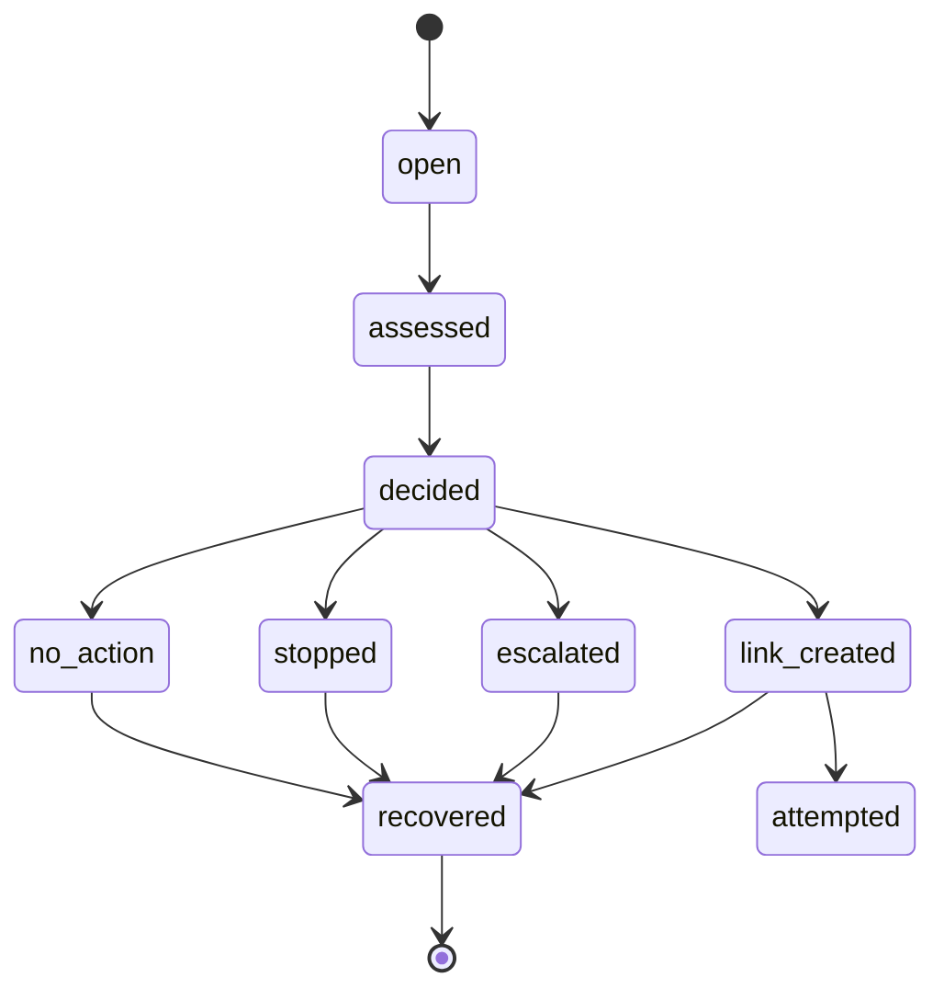

# RecoverAI Architecture

## 1. Problem

A failed payment is revenue at risk, not revenue lost. Recovering it is a targeting and safety problem: decide which failed payments to act on, choose a bounded action, execute it, and measure the money actually recovered, without ever letting an AI move money or contact people it should not.

## 2. Design goals

- Deterministic control over money, state, and policy. AI reasons only inside bounds it did not set.
- Measurable outcomes: recovered rupees attributed only to confirmed successful payments.
- Reliability first: idempotent webhooks, an explicit state machine, safe failure modes.
- Honest evaluation on a held-out batch, with baselines and an ablation.
- Explainability: for every case, why it acted or did not, and how much it recovered.

## 3. Non-goals

- A chatbot or a general LLM agent with tool access.
- A payments dashboard that just reads Razorpay.
- Giving the LLM authority over money, customer contact, or policy.
- Perfect fraud detection or guaranteed recovery.

## 4. Layered architecture

```mermaid
flowchart TD
  W[Razorpay webhook] --> V[signature verify, raw body]
  V --> I[event idempotency claim]
  I --> Q[ack fast, async worker]
  Q --> P[pipeline]
  subgraph Deterministic facts
    P --> PAY[payment state machine]
    P --> CUST[customer identity]
  end
  subgraph Risk and scoring
    PAY --> DIAG[failure diagnosis, risk signals]
    DIAG --> MODEL[calibrated recovery model]
    MODEL --> EV[expected value engine, allowed actions]
  end
  subgraph AI reasoning, bounded
    EV --> AGENT[LLM agent: pick one allowed action, explain]
    AGENT --> GUARD[schema and groundedness guard]
  end
  subgraph Deterministic enforcement
    GUARD --> GATE[policy gate]
    GATE -->|approved| ACT[create Payment Link]
    GATE -->|blocked| STOP[stop or escalate]
  end
  ACT --> RZP[Razorpay Payment Links API]
  RZP --> OUT[payment_link.paid: attribute recovery]
  ACT --> AUD[audit trail]
  STOP --> AUD
  OUT --> AUD
```

The most important property: the box that talks to money (`create Payment Link`) is only reachable through the deterministic policy gate, never directly from the LLM.

## 5. Event flow

1. `payment.failed` arrives. The signature is verified over the raw body. The event id is claimed (unique constraint), which makes processing idempotent.
2. The webhook returns 200 immediately. The rest runs in an in-process async worker so a slow LLM never blocks the acknowledgement.
3. The pipeline resolves the customer, upserts the payment through its state machine, and opens a recovery case.
4. The failure is diagnosed, risk signals are computed, the calibrated model produces a recovery probability, and the expected-value engine computes the bounded action set and a deterministic recommendation.
5. The LLM agent picks one action from the allowed set and writes a grounded explanation. Its output is validated and guarded.
6. The policy gate independently checks the chosen action against runtime state (payment state, opt-out, cooldown, budget, value). If it fails, the action does not execute.
7. If approved and the action is a payment link, a Razorpay Payment Link is created and recorded.
8. When `payment_link.paid` (or a capture) arrives, the recovery is attributed and rupees recovered are recorded, once.
9. Every step writes an audit event keyed by correlation id.

## 6. Data model

Entities (see `apps/api/migrations/001_init.sql`): `merchants`, `customers`, `payments`, `payment_events`, `recovery_cases`, `recovery_decisions`, `recovery_interventions`, `audit_events`, `merchant_policies`.

Notable constraints: `payment_events.provider_event_id` is unique (idempotency), `payments.provider_payment_id` is unique, `recovery_cases.payment_id` is unique (one case per payment), `recovery_interventions.reference_id` is unique. Money columns are `bigint` paise. `payments` and `recovery_cases` carry a `version` column so a stale event cannot silently overwrite a newer confirmed state.

## 7. AI architecture

The agent receives a structured `CaseContext` (all decision-time facts), the deterministically allowed action set, the computed expected value, and a single field of untrusted customer or merchant text. It returns a strict JSON object: one action, a short reason, and a confidence. It cannot return amounts or probabilities that would be treated as truth; those come from the deterministic engine.

Guards, in order:
- schema validation (Zod)
- boundary guard: the chosen action must be in the allowed set, or the decision is rejected
- on any provider error, malformed output, or rejected action, the system falls back to the deterministic recommendation

The provider is abstracted (`mock` default, `gemini` optional). The whole product works with no API key, which keeps evaluation and tests reproducible.

## 8. Decision engine

Expected value of acting is computed net of the counterfactual, so the system credits only incremental recovery:

```
expected value = (p_recover - baseline_self_recovery) * amount - intervention_cost - risk_cost
```

`p_recover` is the calibrated model probability. This is deterministic and is the only source of truth for money math. The allowed action set is derived by a priority-ordered set of rules (opt-out and fraud stop first, then limits, then value bounds, then the value test), so the AI only ever chooses among safe options.

## 9. Policy engine

`MerchantPolicy` defines the bounds of autonomy: max attempts, min and max autonomous value, high-value escalation threshold, cooldown, daily action budget, allowed action types, suspicious-stop. The policy gate is a pure function evaluated before every action. It is independent of the AI on purpose: it is the last line that turns a decision into an action, and it refuses anything outside the bounds.

## 10. Webhook handling

Signatures are HMAC-SHA256 over the exact raw request body, compared in constant time (`X-Razorpay-Signature`). The body is captured as raw bytes by a Fastify content-type parser before JSON parsing. The `X-Razorpay-Event-Id` header is the idempotency key. The endpoint acknowledges within milliseconds and processes asynchronously, tolerating retries and out-of-order delivery.

## 11. Recovery state machine



`recovered` is terminal and reachable from almost anywhere, because a customer can pay at any time. `captured` payments are terminal for the payment state machine and cannot be downgraded by a stale failure.

## 12. Security model

See [SECURITY.md](SECURITY.md). In short: signature verification, event idempotency, deterministic policy gates, prompt-injection defense by construction (untrusted text is data, the action set is fixed before the model runs), secrets only from the environment, PII minimized in logs, parameterized SQL.

## 13. Failure recovery

The system fails safe. If the model is down, the deterministic engine acts. If a payment link fails to create, the case stays recoverable. If a duplicate or stale event arrives, it is deduped or rejected by state. If the process restarts, persisted events and case state make the situation inspectable and recoverable.

## A real failure and the fix

What broke: an integration test for out-of-order events failed. When a `payment.captured` arrived before any `payment.failed` for the same payment id, the capture handler did nothing (it only updated payments that already existed), so a later stale `payment.failed` created the payment fresh in the `failed` state. The final state was wrong: a captured payment showing as failed.

Why it broke: the capture handler assumed a payment row already existed. It handled the common ordering (failure first, then capture) but not the reverse.

How it was detected: a pipeline integration test that deliberately delivers `captured` then `failed` for the same id and asserts the payment ends `captured` and no recovery contact is made.

How it was fixed: the capture handler now upserts the payment as `captured` (creating the customer and payment if needed). The payment state machine then rejects the later `failed` transition, because `captured` is terminal and cannot be downgraded. The stale failure still opens a case, but the policy gate sees a captured payment and blocks any contact (already paid).

How the fix was tested: the same integration test now passes, and it stays in the suite as a regression guard. The unit tests for the payment state machine assert that `captured -> failed` is illegal and `failed -> captured` is legal.

## 14. Evaluation

Held-out, reproducible, generated by `npm run eval`. See [EVALUATION.md](EVALUATION.md). Model metrics (ROC-AUC, PR-AUC, Brier, ECE), targeting precision, a policy comparison against no-action, contact-all, rules, and ML-only baselines, a budgeted targeting curve, an ablation, and an agent safety section.

## 15. Deployment

Single Node service plus PostgreSQL. `docker compose up` starts Postgres; migrations are idempotent and reproducible. The service binds `PORT`, shuts down gracefully on `SIGTERM`, and never requires live Razorpay credentials to run the demo.

## 16. Tradeoffs

- In-process worker instead of a durable queue: simpler for V1, isolated behind one seam so it can be replaced.
- A logistic regression instead of a heavier model: it is calibrated, fast, fully reproducible in the same toolchain, and good enough that the honest story is targeting quality, not model complexity.
- The LLM does not change the business numbers. That is reported plainly rather than hidden. Its value is validity, safety, and explanation.

## 17. Future work

Durable queue and reconciliation, a learned uplift model, multi-step recovery sequences, and a production A/B holdout to measure real incremental recovery.
